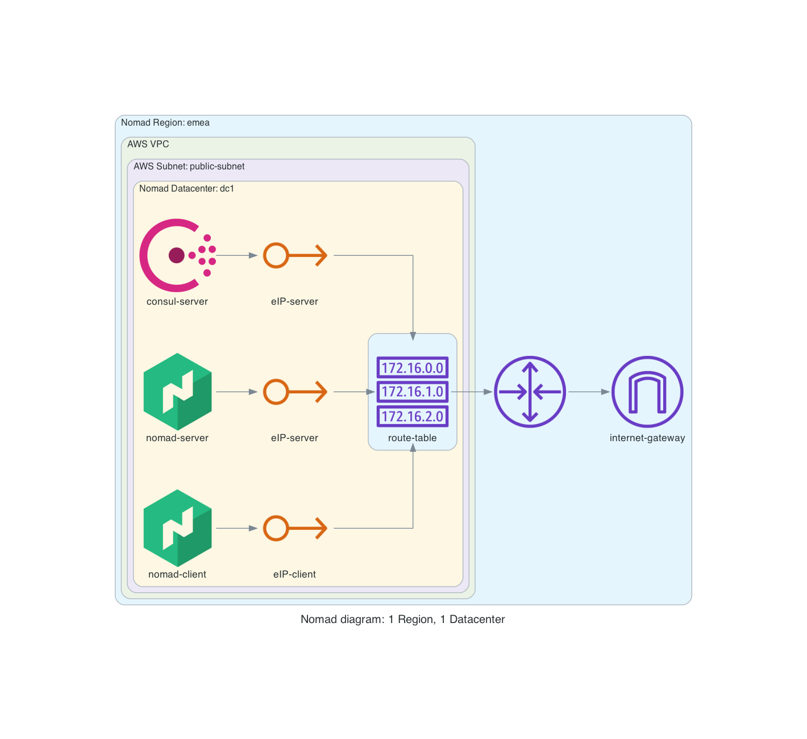

# nomad-aws
nomad cluster following [nomad architecture reference](https://learn.hashicorp.com/tutorials/nomad/production-reference-architecture-vm-with-consul?in=nomad/enterprise)

## Diagram


## How to use this repo
- Clone this repo
```
git clone https://github.com/ion-onboarding/nomad-aws.git
```

- change directory
```
cd nomad-aws
```

## Todo

## Done
- [x] This README
- [x] Diagram
- [x] create `nomad-aws/manually/infrastructure/README.md`
- [x] in `README.md` add manual steps to create components described in the diagram
- [x] test VMs can ping internet and each other
- [x] adjust region to reflect Nomad region and datacenter
- [x] add link to diagram to main README and ./manually/infrastructure/README
