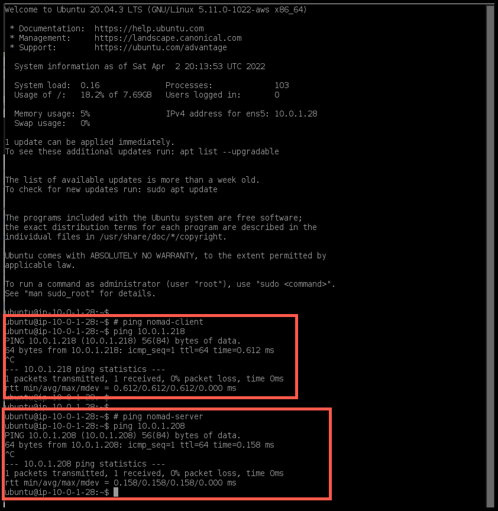

# create 3 vms in AWS
- all resources will be created in region `eu-north-1`

## AWS Region
- Select AWS region

## VPC: vpc
- search vpc services

- caunch VPC

- create VPC

- enable DNS hostnames on vpc

## VPC: Internet Gateway
- create internet gateway

- attach internet gateway to VPC

## VPC: Route Table default route to internet
- access VPC created

- access route table associated with vpc

- select routes

- edit routes

- add route button

- enter route details, point default route to internet gateway

## VPC: Subnet
- create a net subnet

## EC2: ec2
- access ec2 services

## EC2: Security Groups
- access security group menu

- create security group

- select vpc created earlier and allow all traffic in and out
    - this is only temporary to demonstrate a working scenario

## EC2: Key Pairs
- access EC2 `Key Pairs` service

- private key is automatically downloaded

## IAM: policy and role
- access Identity and Access Management services

### IAM policy to describe EC2 instances and tags

- select EC2 service with `DescribeInstances` and `DescribeTags`

- JSON policy looks like this

- optionally add tags

- attach to policy and create the policy

- policy `ec2-describe-instance-describe-tags` is created

### IAM policy allows write complete lifecycle actions on EC2 auto scaling
- create a new policy

- how policy looks like in JSON format

- optionally assign tags

- give policy a name `ec-autoscaling-write-complete-lifecycle`

- policy created

### IAM role to be assumed by an EC2 instance
- create role named `ec2-iam-nomad-consul`

- use AWS service and EC2 instance

- Add Permissions
    - select policy `ec2-describe-instance-describe-tags`

    - select policy `ec-autoscaling-write-complete-lifecycle`

- give role a name, `ec2-iam-nomad-consul`

- iam role created

## EC2: Instances
- select `eu-north-1`

### consul-server
- access and Launch an EC2 instance menu

- attach to the ec2 instance all components created earlier

- consul-server is created

- verify IPs attached to consul-server

### nomad-server
- access and Launch an EC2 instance menu

- instance details: nomad-server
    - attach all details created earlier
    
- nomad-server is created

- verify IPs attached to nomad-server

### nomad-client
- access and Launch an EC2 instance menu

- instance details: nomad-client
    -   attach all details created earlier
    
- nomad-client is created

- verify IPs nomad-client

### Verify there is connectivity
### From nomad-client

### From consul-server

