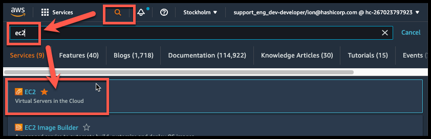
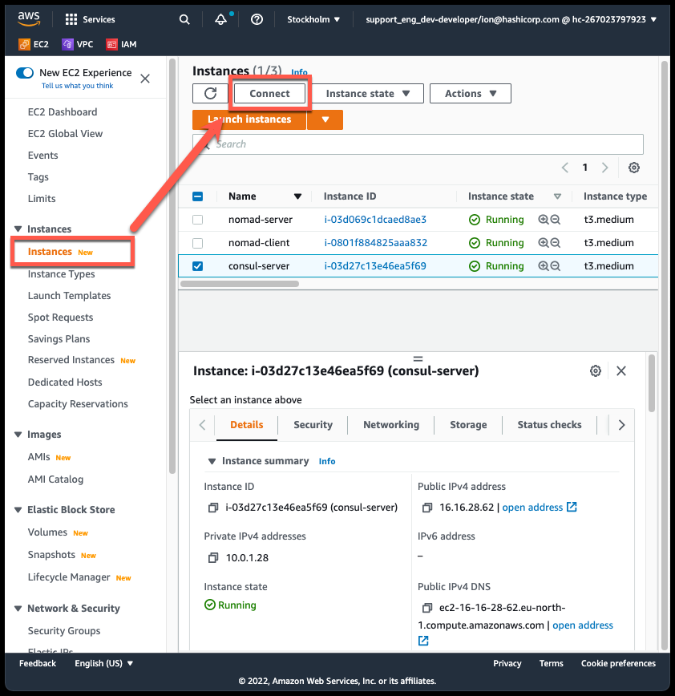
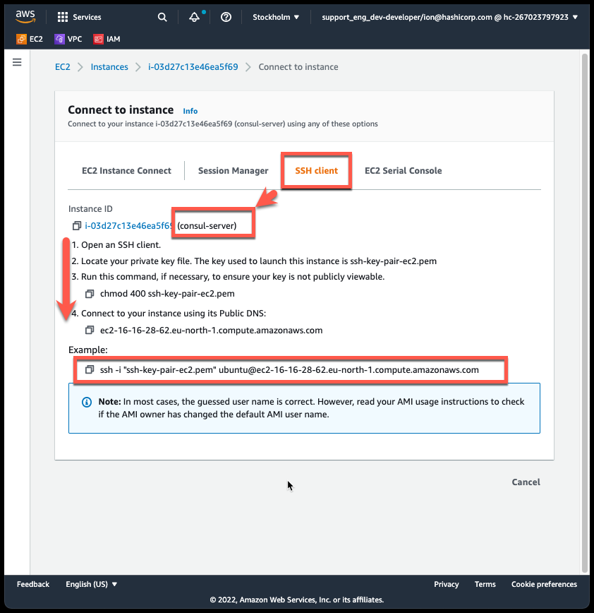

# Manual steps to install nomad and consul

# Select AWS Region
- Select AWS region where resources were created


## Access EC2: Instances

- access ec2 services
    - click search button and search `ec2`
    - click `EC2`


<br/>
<br/>

# SSH how to connect
## SSH connect to `consul-server`
*Same steps applies for `nomad-server` and `nomad-client`*

- access `EC2 Instances` > `Instances`
    - select `consul-server` instance
    - click `Connect` button



- Connect to instance (key / ip / dns changes form setup to setup)
    - Open an SSH client.
    - Locate your private key file.
    - Run this command, if necessary, to ensure your key is not publicly viewable.
        - ```chmod 400 ssh-key-pair-ec2.pem```
    - Connect to your instance using its Public DNS:
        - ```ec2-13-49-69-160.eu-north-1.compute.amazonaws.com```
    - Example:
        - ```ssh -i "ssh-key-pair-ec2.pem" ubuntu@ec2-13-49-69-160.eu-north-1.compute.amazonaws.com```



- This is a sample output from a terminal
```
[ion:~] $ cd ~/Downloads/
[ion:~] $ chmod 400 ssh-key-pair-ec2.pem
[ion:~/Downloads] $ ssh -i "ssh-key-pair-ec2.pem" ubuntu@ec2-16-16-56-28.eu-north-1.compute.amazonaws.com
The authenticity of host 'ec2-16-16-56-28.eu-north-1.compute.amazonaws.com (16.16.56.28)' can't be established.
ECDSA key fingerprint is SHA256:kLs/wS+jRYjxcf6jZvIIw1XYNt1hRtp4olyjr0e4H20.
Are you sure you want to continue connecting (yes/no/[fingerprint])? yes
Warning: Permanently added 'ec2-16-16-56-28.eu-north-1.compute.amazonaws.com,16.16.56.28' (ECDSA) to the list of known hosts.
Welcome to Ubuntu 20.04.3 LTS (GNU/Linux 5.13.0-1019-aws x86_64)

 * Documentation:  https://help.ubuntu.com
 * Management:     https://landscape.canonical.com
 * Support:        https://ubuntu.com/advantage

  System information as of Tue Apr  5 09:11:28 UTC 2022

  System load:  0.25              Processes:             117
  Usage of /:   30.6% of 7.69GB   Users logged in:       0
  Memory usage: 5%                IPv4 address for ens5: 10.0.1.28
  Swap usage:   0%

 * Ubuntu Pro delivers the most comprehensive open source security and
   compliance features.

   https://ubuntu.com/aws/pro

45 updates can be applied immediately.
7 of these updates are standard security updates.
To see these additional updates run: apt list --upgradable


Last login: Mon Apr  4 21:40:23 2022 from 77.162.168.171
ubuntu@consul-server:~$ 
```


# Change hostnames
Set hostname on consul server to `consul-server`
```
sudo hostnamectl set-hostname consul-server
```

Set hostname on consul server to `nomad-server`
```
sudo hostnamectl set-hostname nomad-server
```

Set hostname on consul server to `nomad-client`
```
sudo hostnamectl set-hostname nomad-client
```

Reboot machines to take effect (or open a new shells)
```
sudo systemctl reboot
```

# Consul Installation
## Consul binary on `consul-server`, `nomad-server` & `nomad-client`
Documentation can be found on [Deployment Guide](https://learn.hashicorp.com/tutorials/consul/deployment-guide?in=consul/production-deploy)

Install unzip
```
sudo apt-get update -y
```
```
sudo apt-get install -y unzip
```

Download consul
```
curl -L https://releases.hashicorp.com/consul/1.11.4/consul_1.11.4_linux_amd64.zip \
     -o consul.zip
```
```
ls consul.zip
```

Unzip and move to `/usr/bin/`
```
unzip consul.zip
```
```
sudo chown root:root consul
```
```
sudo mv consul /usr/bin/
```
Create a unique, non-privileged system user to run consul.
```
sudo useradd --system --home /etc/consul.d --shell /bin/false consul
```
Create data directory for consul
```
sudo mkdir --parents /opt/consul/
```
Make consul owner of the data directory
```
sudo chown --recursive consul:consul /opt/consul/
```

## consul systemD service on `consul-server`
```
sudo touch /etc/systemd/system/consul.service
```
Copy paste following file in consul.service
```
[Unit]
Description="HashiCorp Consul - A service mesh solution"
Documentation=https://www.consul.io/
Requires=network-online.target
After=network-online.target
ConditionFileNotEmpty=/etc/consul.d/consul.hcl

[Service]
EnvironmentFile=-/etc/consul.d/consul.env
User=consul
Group=consul
ExecStart=/usr/bin/consul agent -config-dir=/etc/consul.d/
ExecReload=/bin/kill --signal HUP $MAINPID
KillMode=process
KillSignal=SIGTERM
Restart=on-failure
LimitNOFILE=65536

[Install]
WantedBy=multi-user.target

```

## consul configuration on `consul-server`
```
sudo mkdir --parents /etc/consul.d
```
```
sudo touch /etc/consul.d/consul.hcl
```
```
sudo chown --recursive consul:consul /etc/consul.d
```
```
sudo chmod 640 /etc/consul.d/consul.hcl
```

Verify the ip address assigned
```
ip -4 address show
```

```
sudo vim /etc/consul.d/consul.hcl
```

Copy & paste this configuration file `/etc/consul.d/consul.hcl`
```
datacenter = "dc1"
data_dir = "/opt/consul"

bind_addr = "0.0.0.0"

server = true
bootstrap_expect = 1

retry_join = [ "10.0.1.28", ]
retry_max = 5
retry_interval = "15s"

# Consul UI
ui_config {
    enabled = true
}

# service mesh
connect {
  enabled = true
}

addresses {
  grpc = "127.0.0.1"
}

ports {
  grpc  = 8502
}
```

View the consul.service file to check how consul is started
```
cat /etc/systemd/system/consul.service 
```

Start the consul process with user consul using `sudo -u USER`
```
sudo -u consul /usr/bin/consul agent -config-dir=/etc/consul.d/
```

Sometimes it helps to remove all content from /opt/consul/ if server is not starting fine.
```
sudo rm -rf /opt/consul/*
```

Modify the configuration to instruct consul to search for IPs using `{{ GetPrivateIP }}`
See more details [go-sockaddr](https://pkg.go.dev/github.com/hashicorp/go-sockaddr/template?utm_source=godoc)
```
sudo vim /etc/consul.d/consul.hcl
``` 
Copy & paste following content in consul.hcl
```
datacenter = "dc1"
data_dir = "/opt/consul"

bind_addr = "{{ GetInterfaceIP \"ens5\" }}"

server = true
bootstrap_expect = 1

retry_join = [ "{{ GetInterfaceIP \"ens5\" }}", ]
retry_max = 5
retry_interval = "15s"

# Consul UI
ui_config {
    enabled = true
}

# service mesh
connect {
  enabled = true
}

addresses {
  grpc = "127.0.0.1"
}

ports {
  grpc  = 8502
}
```

If the consul process can start successfully without errors, stop it with `CTRL^C`


## systemD consul service enable and start on `consul-server`
Enable consul service
```
sudo systemctl enable consul
```
Start consul service
```
sudo systemctl start consul
```
Verify that consul service is running
```
sudo systemctl status consul
```
Verify consul members
```
consul members -http-addr=http://127.0.0.1:8500
```
```
CONSUL_HTTP_ADDR=http://127.0.0.1:8500 consul members
```

It's helpful on consul-server to view live messages while other clients join
```
journalctl -f -u consul
```

## consul systemD service on `nomad-server`
```
sudo touch /etc/systemd/system/consul.service
```
```
sudo vim /etc/systemd/system/consul.service
```
Copy paste following file in consul.service
```
[Unit]
Description="HashiCorp Consul - A service mesh solution"
Documentation=https://www.consul.io/
Requires=network-online.target
After=network-online.target
ConditionFileNotEmpty=/etc/consul.d/consul.hcl

[Service]
EnvironmentFile=-/etc/consul.d/consul.env
User=consul
Group=consul
ExecStart=/usr/bin/consul agent -config-dir=/etc/consul.d/
ExecReload=/bin/kill --signal HUP $MAINPID
KillMode=process
KillSignal=SIGTERM
Restart=on-failure
LimitNOFILE=65536

[Install]
WantedBy=multi-user.target

```

## consul configuration on `nomad-server`
```
sudo mkdir --parents /etc/consul.d
```
```
sudo touch /etc/consul.d/consul.hcl
```
```
sudo chown --recursive consul:consul /etc/consul.d
```
```
sudo chmod 640 /etc/consul.d/consul.hcl
```

Verify the ip address assigned
```
ip -4 address show
```

```
sudo vim /etc/consul.d/consul.hcl
```

Copy & paste this configuration file `/etc/consul.d/consul.hcl`
```
datacenter = "dc1"
data_dir = "/opt/consul"

bind_addr = "0.0.0.0"

server = false

retry_join = [ "10.0.1.28", ] # << this is the IP of the consul server
retry_max = 5
retry_interval = "15s"


# service mesh
connect {
  enabled = true
}

addresses {
  grpc = "127.0.0.1"
}

ports {
  grpc  = 8502
}
```


## systemD consul service enable and start on `nomad-server`
Enable consul service
```
sudo systemctl enable consul
```
Start consul service
```
sudo systemctl start consul
```
Verify that consul service is running
```
sudo systemctl status consul
```
Verify consul members
```
consul members -http-addr=http://127.0.0.1:8500
```
```
CONSUL_HTTP_ADDR=http://127.0.0.1:8500 consul members
```

## consul systemD service on `nomad-client`
```
sudo touch /etc/systemd/system/consul.service
```
```
sudo vim /etc/systemd/system/consul.service
```
Copy paste following file in consul.service
```
[Unit]
Description="HashiCorp Consul - A service mesh solution"
Documentation=https://www.consul.io/
Requires=network-online.target
After=network-online.target
ConditionFileNotEmpty=/etc/consul.d/consul.hcl

[Service]
EnvironmentFile=-/etc/consul.d/consul.env
User=consul
Group=consul
ExecStart=/usr/bin/consul agent -config-dir=/etc/consul.d/
ExecReload=/bin/kill --signal HUP $MAINPID
KillMode=process
KillSignal=SIGTERM
Restart=on-failure
LimitNOFILE=65536

[Install]
WantedBy=multi-user.target

```

## consul configuration on `nomad-client`
```
sudo mkdir --parents /etc/consul.d
```
```
sudo touch /etc/consul.d/consul.hcl
```
```
sudo chown --recursive consul:consul /etc/consul.d
```
```
sudo chmod 640 /etc/consul.d/consul.hcl
```

Verify the ip address assigned
```
ip -4 address show
```

```
sudo vim /etc/consul.d/consul.hcl
```

Copy & paste this configuration file in `/etc/consul.d/consul.hcl` (ip of server changes on new deployments)
```
datacenter = "dc1"
data_dir = "/opt/consul"

bind_addr = "0.0.0.0"

server = false

retry_join = [ "10.0.1.28", ] # << this is the IP of the consul server
retry_max = 5
retry_interval = "15s"


# service mesh
connect {
  enabled = true
}

addresses {
  grpc = "127.0.0.1"
}

ports {
  grpc  = 8502
}
```

Start the consul process with user consul using `sudo -u USER`
```
sudo -u consul /usr/bin/consul agent -config-dir=/etc/consul.d/
```

If consul on `nomad-client` can join `consul-server` enter `CTRL^C`.


## systemD consul service enable and start on `nomad-client`
Enable consul service
```
sudo systemctl enable consul
```
Start consul service
```
sudo systemctl start consul
```
Verify that consul service is running
```
sudo systemctl status consul
```
Verify consul members
```
consul members -http-addr=http://127.0.0.1:8500
```
```
CONSUL_HTTP_ADDR=http://127.0.0.1:8500 consul members
```

# Nomad Installation
## Nomad binary on `nomad-server` & `nomad-client`
Documentation can be found at [Nomad Deployment Guide](https://learn.hashicorp.com/tutorials/nomad/production-deployment-guide-vm-with-consul?in=nomad/enterprise)

Make sure unzip is installed
```
sudo apt-get update -y
```
```
sudo apt-get install -y unzip
```

Download nomad
```
curl -L https://releases.hashicorp.com/nomad/1.2.6/nomad_1.2.6_linux_amd64.zip \
     -o nomad.zip
```

Unzip and move to `/usr/local/bin`
```
ls nomad.zip
```
```
unzip nomad.zip
```
```
sudo chown root:root nomad
```
```
sudo mv nomad /usr/local/bin/
```

Create a data directory for Nomad
```
sudo mkdir --parents /opt/nomad/
```
```
sudo chown -R nomad:nomad /opt/nomad/
```

Create a unique, non-privileged system user to run Nomad.
```
sudo useradd --system --home /etc/nomad.d --shell /bin/false nomad
```

## nomad systemD service on `nomad-server`
Create a Nomad service file at /etc/systemd/system/nomad.service
```
sudo touch /etc/systemd/system/nomad.service
```

Edit /etc/systemd/system/nomad.service and paste bellow service file
```
sudo vim /etc/systemd/system/nomad.service
```

Nomad service file
```
[Unit]
Description=Nomad
Documentation=https://www.nomadproject.io/docs/
Wants=network-online.target
After=network-online.target

# When using Nomad with Consul it is not necessary to start Consul first. These
# lines start Consul before Nomad as an optimization to avoid Nomad logging
# that Consul is unavailable at startup.
#Wants=consul.service
#After=consul.service

[Service]

# Nomad server should be run as the nomad user. Nomad clients
# should be run as root
User=nomad
Group=nomad

ExecReload=/bin/kill -HUP $MAINPID
ExecStart=/usr/local/bin/nomad agent -config /etc/nomad.d
KillMode=process
KillSignal=SIGINT
LimitNOFILE=65536
LimitNPROC=infinity
Restart=on-failure
RestartSec=2

## Configure unit start rate limiting. Units which are started more than
## *burst* times within an *interval* time span are not permitted to start any
## more. Use `StartLimitIntervalSec` or `StartLimitInterval` (depending on
## systemd version) to configure the checking interval and `StartLimitBurst`
## to configure how many starts per interval are allowed. The values in the
## commented lines are defaults.

# StartLimitBurst = 5

## StartLimitIntervalSec is used for systemd versions >= 230
# StartLimitIntervalSec = 10s

## StartLimitInterval is used for systemd versions < 230
# StartLimitInterval = 10s

TasksMax=infinity
OOMScoreAdjust=-1000

[Install]
WantedBy=multi-user.target

```

## Nomad configuration on `nomad-server`
Create a configuration file at /etc/nomad.d/nomad.hcl
```
sudo mkdir --parents /etc/nomad.d
```
```
sudo chmod 700 /etc/nomad.d
```
```
sudo touch /etc/nomad.d/nomad.hcl
```
```
sudo chown -R nomad:nomad /etc/nomad.d/
```

Copy & paste this configuration file in `/etc/nomad.d/nomad.hcl`
```
sudo vim /etc/nomad.d/nomad.hcl
```

Nomad configuration file
```
region = "emea"
datacenter = "dc1"
data_dir = "/opt/nomad"

bind_addr = "10.0.1.208"

server {
  enabled = true
  bootstrap_expect = 1
   retry_join = [ "10.0.1.208", ]
}

consul {
  address = "127.0.0.1:8500"
#  auth    = "admin:password"
#  token   = "abcd1234"
}

# acl {
#   enabled = true
# }
```

View the nomad service file and see how server is started (see `ExecStart`)
```
sudo cat /etc/systemd/system/nomad.service
```

Start the nomad process with user nomad using `sudo -u USER`
```
sudo -u nomad /usr/local/bin/nomad agent -config /etc/nomad.d
```

If nomad process starts fine enter `CTRL^C`.

Modify the configuration to instruct nomad to search for IPs using `{{ GetInterfaceIP }}`
See more details [go-sockaddr](https://pkg.go.dev/github.com/hashicorp/go-sockaddr/template?utm_source=godoc)

Copy & paste this configuration file in `/etc/nomad.d/nomad.hcl`
```
sudo vim /etc/nomad.d/nomad.hcl
```

Nomad configuration file
```
region = "emea"
datacenter = "dc1"
data_dir = "/opt/nomad"

bind_addr = "{{ GetInterfaceIP \"ens5\" }}"

server {
  enabled = true
  bootstrap_expect = 1
}

consul {
  address = "127.0.0.1:8500"
#  auth    = "admin:password"
#  token   = "abcd1234"
}

# acl {
#   enabled = true
# }
```

View the nomad service file and see how server is started (see `ExecStart`)
```
sudo cat /etc/systemd/system/nomad.service
```

Start the nomad process with user nomad using `sudo -u USER`
```
sudo -u nomad /usr/local/bin/nomad agent -config /etc/nomad.d
```

If nomad process starts fine enter `CTRL^C`.


## systemD Nomad service enable and start on `nomad-server`
Enable nomad service
```
sudo systemctl enable nomad
```
Start nomad service
```
sudo systemctl start nomad
```
Verify that nomad service is running
```
sudo systemctl status nomad
```
Verify nomad server members
```
nomad server members -address=http://10.0.1.208:4646
```
Verify nomad workers (should be zero)
```
nomad node status -address=http://10.0.1.208:4646
```
Export http address
```
export NOMAD_ADDR=http://10.0.1.208:4646
```


## nomad systemD service on `nomad-client`
Create a Nomad service file at /etc/systemd/system/nomad.service
```
sudo touch /etc/systemd/system/nomad.service
```

Edit /etc/systemd/system/nomad.service and paste bellow service file
```
sudo vim /etc/systemd/system/nomad.service
```

Nomad service file
```
[Unit]
Description=Nomad
Documentation=https://www.nomadproject.io/docs/
Wants=network-online.target
After=network-online.target

# When using Nomad with Consul it is not necessary to start Consul first. These
# lines start Consul before Nomad as an optimization to avoid Nomad logging
# that Consul is unavailable at startup.
#Wants=consul.service
#After=consul.service

[Service]

# Nomad server should be run as the nomad user. Nomad clients
# should be run as root
User=root
Group=root

ExecReload=/bin/kill -HUP $MAINPID
ExecStart=/usr/local/bin/nomad agent -config /etc/nomad.d
KillMode=process
KillSignal=SIGINT
LimitNOFILE=65536
LimitNPROC=infinity
Restart=on-failure
RestartSec=2

## Configure unit start rate limiting. Units which are started more than
## *burst* times within an *interval* time span are not permitted to start any
## more. Use `StartLimitIntervalSec` or `StartLimitInterval` (depending on
## systemd version) to configure the checking interval and `StartLimitBurst`
## to configure how many starts per interval are allowed. The values in the
## commented lines are defaults.

# StartLimitBurst = 5

## StartLimitIntervalSec is used for systemd versions >= 230
# StartLimitIntervalSec = 10s

## StartLimitInterval is used for systemd versions < 230
# StartLimitInterval = 10s

TasksMax=infinity
OOMScoreAdjust=-1000

[Install]
WantedBy=multi-user.target

```

## Nomad configuration on `nomad-client`
Create a configuration file at /etc/nomad.d/nomad.hcl
```
sudo mkdir --parents /etc/nomad.d
```
```
sudo chmod 700 /etc/nomad.d
```
```
sudo touch /etc/nomad.d/nomad.hcl
```
```
sudo chown -R nomad:nomad /etc/nomad.d/
```

Copy & paste this configuration file in `/etc/nomad.d/nomad.hcl`
```
sudo vim /etc/nomad.d/nomad.hcl
```

Nomad configuration file
```
region = "emea"
datacenter = "dc1"
data_dir = "/opt/nomad"

bind_addr = "10.0.1.218"

client {
  enabled = true
  server_join {
    retry_join = [ "10.0.1.208",  ]
    retry_max = 5
    retry_interval = "15s"
  }
  options = {
    "driver.raw_exec" = "1"
    "driver.raw_exec.enable" = "1"
  }
}

consul {
  address = "127.0.0.1:8500"
#  auth    = "admin:password"
#  token   = "abcd1234"
}

# acl {
#   enabled = true
# }
```

View the nomad service file and see how server is started (see `ExecStart`)
```
sudo cat /etc/systemd/system/nomad.service
```

Start the nomad process with user nomad using `sudo -u USER`
```
sudo -u root /usr/local/bin/nomad agent -config /etc/nomad.d
```

If nomad process starts fine enter `CTRL^C`.

Modify the configuration to instruct nomad to search for IPs using `{{ GetPrivateIP }}`
See more details [go-sockaddr](https://pkg.go.dev/github.com/hashicorp/go-sockaddr/template?utm_source=godoc)

Copy & paste this configuration file in `/etc/nomad.d/nomad.hcl`
```
sudo vim /etc/nomad.d/nomad.hcl
```

Nomad configuration file
```
region = "emea"
datacenter = "dc1"
data_dir = "/opt/nomad"

bind_addr = "{{ GetInterfaceIP \"ens5\" }}"

client {
  enabled = true
  server_join {
    retry_join = [ "10.0.1.208",  ]
    retry_max = 5
    retry_interval = "15s"
  }
  options = {
    "driver.raw_exec" = "1"
    "driver.raw_exec.enable" = "1"
  }
}

consul {
  address = "127.0.0.1:8500"
#  auth    = "admin:password"
#  token   = "abcd1234"
}

# acl {
#   enabled = true
# }
```

View the nomad service file and see how server is started (see `ExecStart`)
```
sudo cat /etc/systemd/system/nomad.service
```

Start the nomad process with user nomad using `sudo -u USER`
```
sudo -u root /usr/local/bin/nomad agent -config /etc/nomad.d
```

If nomad process starts fine enter `CTRL^C`.

## systemD Nomad service enable and start on `nomad-client`
Enable nomad service
```
sudo systemctl enable nomad
```
Start nomad service
```
sudo systemctl start nomad
```
Verify that nomad service is running
```
sudo systemctl status nomad
```
Verify nomad server members
```
nomad server members -address=http://10.0.1.218:4646
```
```
NOMAD_ADDR=http://10.0.1.218:4646 nomad server members
```

Verify nomad workers
```
nomad node status -address=http://10.0.1.218:4646
```
```
NOMAD_ADDR=http://10.0.1.218:4646 nomad node status
```

Export http address
```
export NOMAD_ADDR=http://10.0.1.208:4646
```

# Install docker binary on `nomad-client`
Install docker using [convenience script](https://docs.docker.com/engine/install/ubuntu/#install-using-the-convenience-script)
```
curl -fsSL https://get.docker.com -o get-docker.sh
```
```
sudo sh get-docker.sh
```

Manage Docker as non-root user [doc link](https://docs.docker.com/engine/install/linux-postinstall/#manage-docker-as-a-non-root-user)
```
sudo groupadd docker
```
```
sudo usermod -aG docker $USER
```

# Install envoy binary on `nomad-client`
```
sudo curl -fsSL https://func-e.io/install.sh | sudo bash -s -- -b /usr/local/bin
```
Get envoy location in a variable
```
ENVOY_LOCATION=`func-e which`
```
Copy envoy to `/usr/local/bin`
```
sudo cp ${ENVOY_LOCATION} /usr/local/bin
```

# Restart nomad & consul on `nomad-client`
To make sure nomad picks up docker installation and consul finds envoy
```
sudo systemctl restart consul
```
```
sudo systemctl restart nomad
```